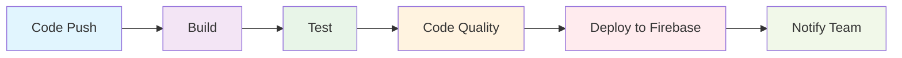

# FursatiCMP 🚀

<div align="center">
  
  
  
  <br>
  
  
</div>

<div align="center">
  <h3>🌟 A Modern Cross-Platform Job Opportunities App 🌟</h3>
  <p>Built with Kotlin Multiplatform & Compose Multiplatform</p>
  <p>Featuring automated CI/CD pipeline with GitHub Actions & Firebase Distribution</p>
</div>

---

## 📋 Table of Contents

- [Overview](#-overview)
- [Technology Stack](#-technology-stack)
- [Architecture](#-architecture)
- [CI/CD Pipeline](#-cicd-pipeline)
- [Getting Started](#-getting-started)
- [Build & Run](#-build--run)
- [Deployment](#-deployment)
- [Challenges & Solutions](#-challenges--solutions)
- [Contributing](#-contributing)
- [Author](#-author)

---

## 🌟 Overview

**FursatiCMP** (فرصتي - My Opportunity) is a comprehensive cross-platform job opportunities management application. Built using cutting-edge Kotlin Multiplatform and Compose Multiplatform technologies, it demonstrates modern mobile development practices with a complete DevOps pipeline.

### Key Highlights

- 🎯 **Cross-Platform**: Single codebase targeting Android, iOS, and Desktop
- 🔄 **CI/CD Automation**: Fully automated build, test, and deployment pipeline
- 🚀 **Modern Architecture**: Clean architecture with shared business logic
- 📱 **Native Performance**: Platform-specific optimizations where needed
- 🔐 **Secure Deployment**: Automated distribution via Firebase App Distribution

---

## 🛠 Technology Stack

### Development
```
Frontend Framework    → Compose Multiplatform
Programming Language  → Kotlin
Architecture         → MVVM + Clean Architecture
Dependency Injection → Koin
Networking           → Ktor
```

### DevOps & CI/CD
```
Version Control      → Git + GitHub
CI/CD Platform      → GitHub Actions
Mobile Deployment   → Firebase App Distribution
Automation Tool     → Fastlane
Build System        → Gradle
Testing Framework   → JUnit + Compose Testing
```

### Platforms
```
📱 Android    → API 24+ (Android 7.0+)
🍎 iOS        → iOS 14.0+
🖥️ Desktop    → JVM (Windows, macOS, Linux)
```

---

## 🏗 Architecture

```
┌─────────────────────────────────────────────────────────────┐
│                    Presentation Layer                       │
│  ┌─────────────┐  ┌─────────────┐  ┌─────────────────────┐  │
│  │   Android   │  │     iOS     │  │       Desktop       │  │
│  │     UI      │  │     UI      │  │         UI          │  │
│  └─────────────┘  └─────────────┘  └─────────────────────┘  │
└─────────────────────────────────────────────────────────────┘
┌─────────────────────────────────────────────────────────────┐
│                   Shared Business Logic                     │
│  ┌─────────────┐  ┌─────────────┐  ┌─────────────────────┐  │
│  │  ViewModels │  │ Use Cases   │  │    Repositories     │  │
│  └─────────────┘  └─────────────┘  └─────────────────────┘  │
└─────────────────────────────────────────────────────────────┘
┌─────────────────────────────────────────────────────────────┐
│                      Data Layer                             │
│  ┌─────────────┐  ┌─────────────┐  ┌─────────────────────┐  │
│  │   Network   │  │   Database  │  │   Local Storage     │  │
│  │    (Ktor)   │  │(SQLDelight) │  │   (DataStore)       │  │
│  └─────────────┘  └─────────────┘  └─────────────────────┘  │
└─────────────────────────────────────────────────────────────┘
```

---

## 🔄 CI/CD Pipeline

Our automated pipeline ensures code quality and reliable deployments:

### Pipeline Stages



### Workflow Configuration

```yaml
# .github/workflows/android-ci.yml
name: Android CI
on:
  push:
    branches: [ main, develop ]
  pull_request:
    branches: [ main ]

jobs:
  build:
    runs-on: ubuntu-latest
    steps:
      - uses: actions/checkout@v4
      - name: Set up JDK 17
        uses: actions/setup-java@v4
        with:
          java-version: '17'
          distribution: 'temurin'
      
      - name: Setup Gradle
        uses: gradle/gradle-build-action@v2
        
      - name: Build with Gradle
        run: ./gradlew build
        
      - name: Run tests
        run: ./gradlew test
        
      - name: Deploy to Firebase
        if: github.ref == 'refs/heads/main'
        env:
          FIREBASE_CLI_TOKEN: ${{ secrets.FIREBASE_CLI_TOKEN }}
        run: |
          npm install -g firebase-tools
          firebase appdistribution:distribute app/build/outputs/apk/release/app-release.apk
```

---

## 🚀 Getting Started

### Prerequisites

- **JDK 17** or higher
- **Android Studio** Hedgehog or later
- **Xcode 15** (for iOS development)
- **Git** for version control

### Installation

1. **Clone the repository**
   ```bash
   git clone https://github.com/MohannedSohail/FursatiCMP_CI-CD.git
   cd FursatiCMP_CI-CD
   ```

2. **Make gradlew executable**
   ```bash
   chmod +x gradlew
   ```

3. **Install dependencies**
   ```bash
   ./gradlew build
   ```

---

## 🔧 Build & Run

### Android
```bash
# Debug build
./gradlew :composeApp:assembleDebug

# Run on device/emulator
./gradlew :composeApp:installDebug
```

### iOS
```bash
# Open in Xcode
open iosApp/iosApp.xcworkspace

# Or build from command line
./gradlew :composeApp:embedAndSignAppleFrameworkForXcode
```

### Desktop
```bash
# Run desktop application
./gradlew :composeApp:run

# Create distribution
./gradlew :composeApp:createDistributable
```

---

## 🚀 Deployment

### Automatic Deployment
- **Triggered on**: Push to `main` branch
- **Platform**: Firebase App Distribution
- **Notification**: Automatic team notifications
- **Artifacts**: APK, IPA, and Desktop distributions

### Manual Deployment
```bash
# Deploy to Firebase using Fastlane
bundle exec fastlane deploy

# Or using Firebase CLI
firebase appdistribution:distribute app/build/outputs/apk/release/app-release.apk \
  --app YOUR_APP_ID \
  --groups "testers"
```

---

## 💡 Challenges & Solutions

### 🔧 Technical Challenges

<details>
<summary><strong>Platform Compatibility Issues</strong></summary>

**Problem**: Bundle installation failed due to platform mismatch between development and CI environments.

**Solution**: 
```bash
bundle lock --add-platform x86_64-linux
bundle lock --add-platform arm64-darwin
```

**Impact**: Ensured consistent dependency management across different runner environments.
</details>

<details>
<summary><strong>Firebase Authentication in CI</strong></summary>

**Problem**: Deployment failed due to missing Firebase CLI token in GitHub Actions.

**Solution**: 
- Generated Firebase CLI token: `firebase login:ci`
- Added `FIREBASE_CLI_TOKEN` to GitHub Secrets
- Updated workflow to use the token securely

**Impact**: Enabled secure automated deployment to Firebase App Distribution.
</details>

<details>
<summary><strong>Multiplatform Build Coordination</strong></summary>

**Problem**: Complex build process for multiple platforms with different requirements.

**Solution**: 
- Implemented conditional build steps
- Created platform-specific build configurations
- Optimized build caching strategies

**Impact**: Reduced build times and improved pipeline reliability.
</details>

---

## 🤝 Contributing

We welcome contributions! Please follow these steps:

1. **Fork** the repository
2. **Create** a feature branch: `git checkout -b feature/amazing-feature`
3. **Commit** your changes: `git commit -m 'Add amazing feature'`
4. **Push** to the branch: `git push origin feature/amazing-feature`
5. **Open** a Pull Request

### Development Guidelines

- Follow [Kotlin Coding Conventions](https://kotlinlang.org/docs/coding-conventions.html)
- Write tests for new features
- Update documentation as needed
- Ensure CI/CD pipeline passes

---

## 🙋‍♂️ Author

<div align="center">
  
**Mohanned Sohail**  
*Kotlin & Compose Multiplatform & Android JetpackCompose Developer*

[](https://github.com/MohannedSohail)
[](https://www.linkedin.com/in/mohannedsoahil/)
[](mailto:mohannedsohail@gmail.com)

</div>

---

## 🌟 Support

If you found this project helpful, please consider:

- ⭐ **Star** this repository
- 🐛 **Report** bugs and issues
- 💡 **Suggest** new features
- 🔀 **Share** with the community

---

<div align="center">
  <p>Made with ❤️ using Kotlin Multiplatform & Compose Multiplatform</p>
  <p>© 2025 Mohanned Sohail. All rights reserved.</p>
</div>
